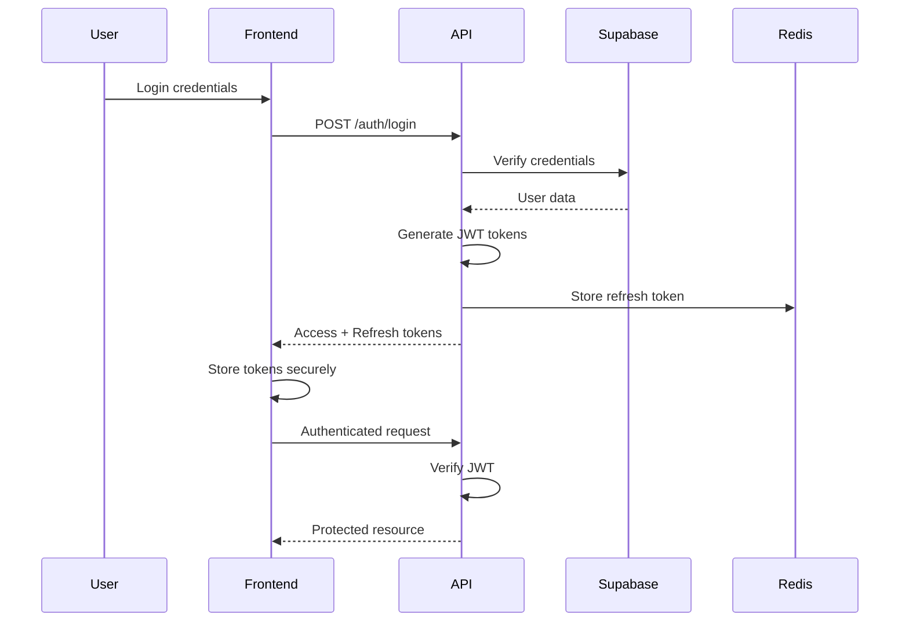
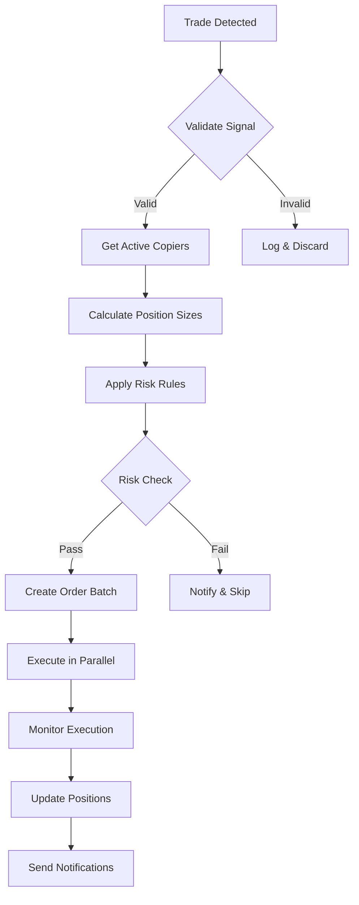

# Technical Specification - CopyTrade V2 Platform

## Table of Contents
1. [Executive Summary](#executive-summary)
2. [System Architecture](#system-architecture)
3. [Technology Stack](#technology-stack)
4. [Core Components](#core-components)
5. [Database Design](#database-design)
6. [API Design](#api-design)
7. [Security Architecture](#security-architecture)
8. [Real-time Trading Architecture](#real-time-trading-architecture)
9. [Scalability & Performance](#scalability--performance)
10. [DevOps & Deployment](#devops--deployment)
11. [Monitoring & Observability](#monitoring--observability)
12. [Technical Constraints & Decisions](#technical-constraints--decisions)

## Executive Summary

CopyTrade V2 is a platform-agnostic copy trading system that enables traders to broadcast their trades and allows copiers to automatically replicate these trades on their connected exchange accounts. The platform supports both Bitget and Bybit exchanges, with a modern web interface built on Next.js and a robust backend powered by FastAPI.

### Key Technical Goals
- **Multi-platform support**: Seamless integration with Bitget and Bybit
- **Real-time trade replication**: Sub-second trade detection and execution
- **Scalability**: Support for 10,000+ concurrent users
- **Security**: Bank-grade encryption for API keys and user data
- **Reliability**: 99.9% uptime with automatic failover
- **User Experience**: Modern, responsive web interface

## System Architecture

### High-Level Architecture

```
┌─────────────────────────────────────────────────────────────────┐
│                         Frontend Layer                           │
│  ┌─────────────┐  ┌──────────────┐  ┌────────────────────┐    │
│  │   Next.js   │  │   Tailwind   │  │      shadcn/ui     │    │
│  │   App Dir   │  │     CSS      │  │    Components      │    │
│  └─────────────┘  └──────────────┘  └────────────────────┘    │
└─────────────────────────────────────────────────────────────────┘
                                │
                                ▼
┌─────────────────────────────────────────────────────────────────┐
│                      API Gateway (Vercel)                        │
│  ┌─────────────┐  ┌──────────────┐  ┌────────────────────┐    │
│  │    Auth     │  │  Rate Limit  │  │      CORS          │    │
│  │ Middleware  │  │  Middleware  │  │    Handling        │    │
│  └─────────────┘  └──────────────┘  └────────────────────┘    │
└─────────────────────────────────────────────────────────────────┘
                                │
                                ▼
┌─────────────────────────────────────────────────────────────────┐
│                    Backend Services (FastAPI)                    │
│  ┌─────────────┐  ┌──────────────┐  ┌────────────────────┐    │
│  │   Trading   │  │    User      │  │   Notification     │    │
│  │   Service   │  │  Management  │  │     Service        │    │
│  └─────────────┘  └──────────────┘  └────────────────────┘    │
│  ┌─────────────┐  ┌──────────────┐  ┌────────────────────┐    │
│  │  Position   │  │   Analytics  │  │      Admin         │    │
│  │ Monitoring  │  │   Service    │  │     Service        │    │
│  └─────────────┘  └──────────────┘  └────────────────────┘    │
└─────────────────────────────────────────────────────────────────┘
                                │
                ┌───────────────┴───────────────┐
                ▼                               ▼
┌──────────────────────────┐    ┌──────────────────────────┐
│   Exchange Connectors    │    │    Data Persistence      │
│  ┌────────┐ ┌─────────┐ │    │  ┌─────────────────┐    │
│  │ Bitget │ │  Bybit  │ │    │  │    Supabase     │    │
│  │  API   │ │   V5    │ │    │  │   PostgreSQL    │    │
│  └────────┘ └─────────┘ │    │  └─────────────────┘    │
│  ┌────────────────────┐ │    │  ┌─────────────────┐    │
│  │ WebSocket Clients  │ │    │  │      Redis      │    │
│  └────────────────────┘ │    │  │     (Cache)     │    │
└──────────────────────────┘    │  └─────────────────┘    │
                                └──────────────────────────┘
```

### Microservices Architecture

Each service is designed to be independently scalable and deployable:

1. **Trading Service**: Handles trade detection, signal processing, and execution
2. **User Management Service**: Authentication, authorization, and user profiles
3. **Position Monitoring Service**: Tracks open positions and manages risk
4. **Analytics Service**: Performance metrics, P&L calculation, and reporting
5. **Notification Service**: Telegram, Discord, and email notifications
6. **Admin Service**: Platform management, user moderation, and system configuration

## Technology Stack

### Frontend
- **Framework**: Next.js 14 (App Directory)
- **Language**: TypeScript 5.x
- **Styling**: Tailwind CSS 3.x
- **UI Components**: shadcn/ui
- **State Management**: Zustand
- **Data Fetching**: TanStack Query (React Query)
- **Real-time**: Socket.io Client
- **Charts**: TradingView Lightweight Charts
- **Forms**: React Hook Form + Zod
- **Authentication**: NextAuth.js with Supabase adapter

### Backend
- **Framework**: FastAPI 0.104+
- **Language**: Python 3.11+
- **Async Runtime**: uvicorn with Gunicorn
- **ORM**: SQLAlchemy 2.0 (async)
- **Validation**: Pydantic V2
- **Task Queue**: Celery with Redis
- **WebSockets**: python-socketio
- **API Documentation**: OpenAPI 3.0 (auto-generated)

### Infrastructure
- **Database**: Supabase (PostgreSQL 15)
- **Cache**: Redis 7.x
- **Message Queue**: Redis Streams
- **File Storage**: Supabase Storage
- **Hosting**: 
  - Frontend: Vercel
  - Backend: Render.com (with autoscaling)
- **CDN**: Vercel Edge Network
- **Monitoring**: Sentry + Custom OpenTelemetry

### External Services
- **Exchanges**:
  - Bitget API (REST + WebSocket)
  - Bybit V5 API (REST + WebSocket)
- **AI**: Google Gemini API
- **Notifications**:
  - Telegram Bot API
  - Discord Webhooks
  - SendGrid (email)
- **Analytics**: PostHog
- **Error Tracking**: Sentry

## Core Components

### 1. Authentication & Authorization

```python
# Authentication flow
class AuthenticationService:
    - JWT token generation with refresh tokens
    - Role-based access control (RBAC)
    - Multi-factor authentication (TOTP)
    - Session management with Redis
    - OAuth2 integration (future)
```

**Roles**:
- **Trader**: Can broadcast trades, manage strategies
- **Copier**: Can follow traders, set risk parameters
- **Admin**: Full platform access, user management
- **Viewer**: Read-only access to public data

### 2. Exchange Integration Layer

```python
class ExchangeConnector(ABC):
    """Abstract base for exchange connectors"""
    
    async def connect(self) -> None
    async def place_order(self, order: Order) -> OrderResult
    async def cancel_order(self, order_id: str) -> bool
    async def get_positions(self) -> List[Position]
    async def subscribe_to_trades(self, callback: Callable) -> None
    
class BitgetConnector(ExchangeConnector):
    """Bitget-specific implementation"""
    - REST API client with rate limiting
    - WebSocket client for real-time data
    - Order type mapping
    - Error handling and retry logic
    
class BybitConnector(ExchangeConnector):
    """Bybit V5 implementation"""
    - Unified trading interface
    - Smart order routing
    - Position management
    - Advanced order types support
```

### 3. Trade Detection & Replication Engine

```python
class TradeReplicationEngine:
    """Core engine for detecting and replicating trades"""
    
    Components:
    - Trade Detector: WebSocket listeners for each trader
    - Signal Processor: Validates and enriches trade signals
    - Risk Manager: Applies copier-specific risk rules
    - Execution Engine: Places orders on copier accounts
    - Position Tracker: Monitors all open positions
    
    Flow:
    1. Detect trade on trader account via WebSocket
    2. Validate trade signal (size, symbol, direction)
    3. Calculate position size for each copier
    4. Apply risk management rules
    5. Execute trades in parallel
    6. Track and monitor positions
    7. Send notifications
```

### 4. Risk Management System

```python
class RiskManagementSystem:
    """Comprehensive risk management"""
    
    Features:
    - Value at Risk (VAR) calculations
    - Maximum drawdown limits
    - Position size limits
    - Daily loss limits
    - Correlation analysis
    - Portfolio heat mapping
    
    Rules Engine:
    - Per-trade risk limits
    - Account-level risk limits
    - Symbol-specific limits
    - Time-based restrictions
    - Leverage controls
```

### 5. Real-time Communication

```python
class RealtimeService:
    """WebSocket service for real-time updates"""
    
    Channels:
    - /trades/{trader_id}: Live trade updates
    - /positions/{user_id}: Position updates
    - /analytics/{user_id}: Performance metrics
    - /notifications/{user_id}: System notifications
    
    Features:
    - Automatic reconnection
    - Message queuing
    - Presence detection
    - Room-based broadcasting
```

## Database Design

### Core Tables

```sql
-- Users table
CREATE TABLE users (
    id UUID PRIMARY KEY DEFAULT gen_random_uuid(),
    email VARCHAR(255) UNIQUE NOT NULL,
    username VARCHAR(50) UNIQUE NOT NULL,
    role VARCHAR(20) NOT NULL CHECK (role IN ('trader', 'copier', 'admin')),
    is_active BOOLEAN DEFAULT true,
    created_at TIMESTAMP WITH TIME ZONE DEFAULT NOW(),
    updated_at TIMESTAMP WITH TIME ZONE DEFAULT NOW()
);

-- Exchange connections
CREATE TABLE exchange_connections (
    id UUID PRIMARY KEY DEFAULT gen_random_uuid(),
    user_id UUID REFERENCES users(id) ON DELETE CASCADE,
    exchange VARCHAR(20) NOT NULL CHECK (exchange IN ('bitget', 'bybit')),
    api_key_encrypted TEXT NOT NULL,
    api_secret_encrypted TEXT NOT NULL,
    is_testnet BOOLEAN DEFAULT false,
    is_active BOOLEAN DEFAULT true,
    permissions JSONB NOT NULL DEFAULT '{"spot": false, "futures": true}',
    last_sync TIMESTAMP WITH TIME ZONE,
    created_at TIMESTAMP WITH TIME ZONE DEFAULT NOW()
);

-- Trader profiles
CREATE TABLE trader_profiles (
    id UUID PRIMARY KEY DEFAULT gen_random_uuid(),
    user_id UUID UNIQUE REFERENCES users(id) ON DELETE CASCADE,
    display_name VARCHAR(100) NOT NULL,
    description TEXT,
    strategy_description TEXT,
    min_copy_amount DECIMAL(10, 2) DEFAULT 100,
    performance_fee DECIMAL(5, 2) DEFAULT 0,
    is_public BOOLEAN DEFAULT true,
    statistics JSONB DEFAULT '{}',
    created_at TIMESTAMP WITH TIME ZONE DEFAULT NOW()
);

-- Copy relationships
CREATE TABLE copy_relationships (
    id UUID PRIMARY KEY DEFAULT gen_random_uuid(),
    copier_id UUID REFERENCES users(id) ON DELETE CASCADE,
    trader_id UUID REFERENCES users(id) ON DELETE CASCADE,
    exchange_connection_id UUID REFERENCES exchange_connections(id),
    risk_settings JSONB NOT NULL DEFAULT '{}',
    is_active BOOLEAN DEFAULT true,
    created_at TIMESTAMP WITH TIME ZONE DEFAULT NOW(),
    UNIQUE(copier_id, trader_id)
);

-- Trades
CREATE TABLE trades (
    id UUID PRIMARY KEY DEFAULT gen_random_uuid(),
    user_id UUID REFERENCES users(id) ON DELETE CASCADE,
    exchange VARCHAR(20) NOT NULL,
    symbol VARCHAR(20) NOT NULL,
    side VARCHAR(10) NOT NULL CHECK (side IN ('buy', 'sell')),
    order_type VARCHAR(20) NOT NULL,
    quantity DECIMAL(20, 8) NOT NULL,
    price DECIMAL(20, 8),
    status VARCHAR(20) NOT NULL,
    exchange_order_id VARCHAR(100),
    parent_trade_id UUID REFERENCES trades(id),
    metadata JSONB DEFAULT '{}',
    created_at TIMESTAMP WITH TIME ZONE DEFAULT NOW(),
    executed_at TIMESTAMP WITH TIME ZONE
);

-- Positions
CREATE TABLE positions (
    id UUID PRIMARY KEY DEFAULT gen_random_uuid(),
    user_id UUID REFERENCES users(id) ON DELETE CASCADE,
    exchange VARCHAR(20) NOT NULL,
    symbol VARCHAR(20) NOT NULL,
    side VARCHAR(10) NOT NULL,
    quantity DECIMAL(20, 8) NOT NULL,
    entry_price DECIMAL(20, 8) NOT NULL,
    current_price DECIMAL(20, 8),
    unrealized_pnl DECIMAL(20, 8),
    realized_pnl DECIMAL(20, 8) DEFAULT 0,
    status VARCHAR(20) NOT NULL DEFAULT 'open',
    opened_at TIMESTAMP WITH TIME ZONE DEFAULT NOW(),
    closed_at TIMESTAMP WITH TIME ZONE
);

-- Risk settings
CREATE TABLE risk_settings (
    id UUID PRIMARY KEY DEFAULT gen_random_uuid(),
    user_id UUID UNIQUE REFERENCES users(id) ON DELETE CASCADE,
    var_type VARCHAR(20) NOT NULL DEFAULT 'percentage',
    var_amount DECIMAL(10, 2) NOT NULL DEFAULT 10,
    max_trades_per_day INTEGER DEFAULT 20,
    max_position_size DECIMAL(20, 2),
    max_drawdown DECIMAL(5, 2) DEFAULT 20,
    allowed_symbols TEXT[],
    blocked_symbols TEXT[],
    trading_hours JSONB DEFAULT '{}',
    updated_at TIMESTAMP WITH TIME ZONE DEFAULT NOW()
);

-- Notifications settings
CREATE TABLE notification_settings (
    id UUID PRIMARY KEY DEFAULT gen_random_uuid(),
    user_id UUID UNIQUE REFERENCES users(id) ON DELETE CASCADE,
    telegram_enabled BOOLEAN DEFAULT false,
    telegram_chat_id VARCHAR(100),
    discord_enabled BOOLEAN DEFAULT false,
    discord_webhook_url TEXT,
    email_enabled BOOLEAN DEFAULT true,
    notification_types JSONB DEFAULT '{"trades": true, "errors": true, "performance": false}',
    updated_at TIMESTAMP WITH TIME ZONE DEFAULT NOW()
);

-- Analytics and performance
CREATE TABLE performance_metrics (
    id UUID PRIMARY KEY DEFAULT gen_random_uuid(),
    user_id UUID REFERENCES users(id) ON DELETE CASCADE,
    date DATE NOT NULL,
    total_trades INTEGER DEFAULT 0,
    winning_trades INTEGER DEFAULT 0,
    losing_trades INTEGER DEFAULT 0,
    total_pnl DECIMAL(20, 2) DEFAULT 0,
    win_rate DECIMAL(5, 2),
    sharpe_ratio DECIMAL(10, 4),
    max_drawdown DECIMAL(10, 2),
    metrics JSONB DEFAULT '{}',
    created_at TIMESTAMP WITH TIME ZONE DEFAULT NOW(),
    UNIQUE(user_id, date)
);

-- Audit logs
CREATE TABLE audit_logs (
    id UUID PRIMARY KEY DEFAULT gen_random_uuid(),
    user_id UUID REFERENCES users(id),
    action VARCHAR(100) NOT NULL,
    resource_type VARCHAR(50),
    resource_id UUID,
    changes JSONB DEFAULT '{}',
    ip_address INET,
    user_agent TEXT,
    created_at TIMESTAMP WITH TIME ZONE DEFAULT NOW()
);

-- Indexes for performance
CREATE INDEX idx_trades_user_created ON trades(user_id, created_at DESC);
CREATE INDEX idx_trades_parent ON trades(parent_trade_id) WHERE parent_trade_id IS NOT NULL;
CREATE INDEX idx_positions_user_status ON positions(user_id, status);
CREATE INDEX idx_copy_relationships_active ON copy_relationships(trader_id) WHERE is_active = true;
CREATE INDEX idx_performance_metrics_user_date ON performance_metrics(user_id, date DESC);
CREATE INDEX idx_audit_logs_user_created ON audit_logs(user_id, created_at DESC);
```

### Database Patterns

1. **Encryption**: All sensitive data (API keys) encrypted using AES-256
2. **Soft Deletes**: Most entities use `is_active` flags instead of hard deletes
3. **Audit Trail**: Comprehensive logging of all user actions
4. **JSONB Usage**: Flexible schema for settings and metadata
5. **Time Zones**: All timestamps stored in UTC
6. **Constraints**: Database-level constraints for data integrity

## API Design

### RESTful Endpoints

```yaml
# Authentication
POST   /api/auth/register
POST   /api/auth/login
POST   /api/auth/refresh
POST   /api/auth/logout
POST   /api/auth/verify-email
POST   /api/auth/reset-password

# User Management
GET    /api/users/profile
PUT    /api/users/profile
GET    /api/users/{user_id}/public-profile
DELETE /api/users/account

# Exchange Connections
GET    /api/exchanges/connections
POST   /api/exchanges/connections
PUT    /api/exchanges/connections/{connection_id}
DELETE /api/exchanges/connections/{connection_id}
POST   /api/exchanges/connections/{connection_id}/test

# Trading
GET    /api/traders
GET    /api/traders/{trader_id}
GET    /api/traders/{trader_id}/statistics
GET    /api/traders/{trader_id}/trades
POST   /api/traders/follow
DELETE /api/traders/unfollow/{trader_id}

# Copy Settings
GET    /api/copy-settings
PUT    /api/copy-settings/{relationship_id}
GET    /api/copy-settings/relationships
POST   /api/copy-settings/pause/{relationship_id}
POST   /api/copy-settings/resume/{relationship_id}

# Positions & Trades
GET    /api/positions
GET    /api/positions/{position_id}
POST   /api/positions/{position_id}/close
GET    /api/trades
GET    /api/trades/{trade_id}
GET    /api/trades/history

# Risk Management
GET    /api/risk/settings
PUT    /api/risk/settings
GET    /api/risk/analysis
GET    /api/risk/var-calculation

# Analytics
GET    /api/analytics/dashboard
GET    /api/analytics/performance
GET    /api/analytics/pnl
GET    /api/analytics/comparison
GET    /api/analytics/export

# Notifications
GET    /api/notifications/settings
PUT    /api/notifications/settings
POST   /api/notifications/test
GET    /api/notifications/history

# Admin
GET    /api/admin/users
PUT    /api/admin/users/{user_id}
GET    /api/admin/system/health
GET    /api/admin/system/metrics
POST   /api/admin/system/maintenance

# Webhooks
POST   /api/webhooks/telegram
POST   /api/webhooks/discord
```

### WebSocket Events

```javascript
// Client -> Server
{
  "subscribe": {
    "trades": ["trader_id_1", "trader_id_2"],
    "positions": true,
    "analytics": true
  }
}

// Server -> Client
{
  "type": "trade",
  "data": {
    "trader_id": "uuid",
    "trade": {
      "symbol": "BTCUSDT",
      "side": "buy",
      "quantity": 0.1,
      "price": 45000,
      "timestamp": "2024-01-01T00:00:00Z"
    }
  }
}

{
  "type": "position_update",
  "data": {
    "position_id": "uuid",
    "unrealized_pnl": 150.50,
    "current_price": 45500
  }
}

{
  "type": "notification",
  "data": {
    "level": "info",
    "message": "Trade executed successfully",
    "metadata": {}
  }
}
```

### API Standards

1. **Versioning**: URL path versioning (`/api/v1/`)
2. **Pagination**: Cursor-based pagination for large datasets
3. **Rate Limiting**: 
   - Anonymous: 100 req/hour
   - Authenticated: 1000 req/hour
   - Traders: 5000 req/hour
4. **Response Format**:
   ```json
   {
     "success": true,
     "data": {},
     "error": null,
     "metadata": {
       "timestamp": "2024-01-01T00:00:00Z",
       "request_id": "uuid"
     }
   }
   ```
5. **Error Handling**: Consistent error codes and messages
6. **CORS**: Configurable origin whitelist
7. **Compression**: Gzip for all responses

## Security Architecture

### API Key Management

```python
class APIKeyManager:
    """Secure API key storage and retrieval"""
    
    Encryption:
    - AES-256-GCM encryption
    - Unique encryption key per user
    - Keys derived from master key using PBKDF2
    
    Storage:
    - Encrypted keys in database
    - Encryption keys in separate secure storage
    - No plaintext keys in logs or backups
    
    Access:
    - Decryption only when needed
    - Keys cached in memory for active sessions
    - Automatic key rotation every 90 days
```

### Authentication Flow



### Security Measures

1. **Data Encryption**:
   - TLS 1.3 for all communications
   - End-to-end encryption for sensitive data
   - Encrypted database connections

2. **Access Control**:
   - JWT with short expiry (15 minutes)
   - Refresh token rotation
   - IP whitelisting for admin actions
   - Rate limiting per endpoint

3. **API Security**:
   - HMAC signature verification
   - Request replay protection
   - API key scoping
   - Automatic key rotation

4. **Infrastructure Security**:
   - VPC isolation
   - WAF protection
   - DDoS mitigation
   - Regular security audits

5. **Compliance**:
   - GDPR compliance
   - Data residency options
   - Right to deletion
   - Audit logging

## Real-time Trading Architecture

### Trade Detection Pipeline

```python
class TradeDetectionPipeline:
    """High-performance trade detection system"""
    
    Components:
    1. WebSocket Managers (per exchange)
       - Connection pooling
       - Automatic reconnection
       - Message deduplication
       
    2. Trade Parser
       - Exchange-specific parsers
       - Unified trade format
       - Validation layer
       
    3. Signal Router
       - Fan-out to copiers
       - Priority queuing
       - Load balancing
       
    4. Execution Manager
       - Parallel execution
       - Retry logic
       - Failure handling
```

### Order Execution Flow



### Performance Optimizations

1. **Connection Pooling**: Reuse exchange connections
2. **Batch Processing**: Group orders for efficiency
3. **Caching**: Redis for hot data
4. **Async Processing**: Non-blocking I/O throughout
5. **Circuit Breakers**: Prevent cascade failures
6. **Load Balancing**: Distribute load across workers

## Scalability & Performance

### Horizontal Scaling Strategy

```yaml
services:
  api:
    replicas: 3-10  # Auto-scale based on CPU/memory
    resources:
      cpu: 2
      memory: 4Gi
    
  trading-workers:
    replicas: 5-20  # Scale based on queue depth
    resources:
      cpu: 1
      memory: 2Gi
    
  websocket-managers:
    replicas: 2-5   # Per exchange
    resources:
      cpu: 1
      memory: 1Gi
```

### Caching Strategy

1. **Redis Caching Layers**:
   - Session cache (user sessions)
   - API cache (frequently accessed data)
   - Position cache (active positions)
   - Market data cache (prices, symbols)

2. **Cache Policies**:
   - TTL-based expiration
   - LRU eviction
   - Write-through for critical data
   - Cache warming on startup

### Database Optimization

1. **Query Optimization**:
   - Prepared statements
   - Query result caching
   - Materialized views for analytics
   - Partitioning for time-series data

2. **Connection Pooling**:
   - PgBouncer for PostgreSQL
   - Connection limits per service
   - Idle connection timeout

3. **Read Replicas**:
   - Analytics queries on replicas
   - Geographic distribution
   - Automatic failover

## DevOps & Deployment

### CI/CD Pipeline

```yaml
# .github/workflows/deploy.yml
name: Deploy to Production

on:
  push:
    branches: [main]

jobs:
  test:
    runs-on: ubuntu-latest
    steps:
      - uses: actions/checkout@v3
      - name: Run tests
        run: |
          pytest tests/
          npm test
          
  build:
    needs: test
    runs-on: ubuntu-latest
    steps:
      - name: Build Docker images
        run: |
          docker build -t api:$GITHUB_SHA ./backend
          docker build -t frontend:$GITHUB_SHA ./frontend
          
  deploy:
    needs: build
    runs-on: ubuntu-latest
    steps:
      - name: Deploy to Render
        run: |
          render deploy --service api --image api:$GITHUB_SHA
      - name: Deploy to Vercel
        run: |
          vercel deploy --prod
```

### Infrastructure as Code

```terraform
# infrastructure/main.tf
resource "supabase_project" "main" {
  name            = "copytrade-v2"
  database_password = var.db_password
  region          = "us-east-1"
}

resource "redis_instance" "cache" {
  name            = "copytrade-cache"
  memory_size_gb  = 4
  redis_version   = "7.0"
}

resource "render_service" "api" {
  name    = "copytrade-api"
  type    = "web_service"
  runtime = "python"
  
  scaling {
    min_instances = 2
    max_instances = 10
    target_cpu    = 70
  }
}
```

### Environment Configuration

```yaml
# config/production.yml
database:
  url: ${DATABASE_URL}
  pool_size: 20
  max_overflow: 40

redis:
  url: ${REDIS_URL}
  max_connections: 100

exchanges:
  rate_limits:
    bitget: 20  # requests per second
    bybit: 30

monitoring:
  sentry_dsn: ${SENTRY_DSN}
  log_level: INFO
  
security:
  jwt_secret: ${JWT_SECRET}
  encryption_key: ${ENCRYPTION_KEY}
```

## Monitoring & Observability

### Metrics Collection

```python
# Custom metrics
TRADE_EXECUTION_TIME = Histogram(
    'trade_execution_duration_seconds',
    'Time taken to execute a trade',
    ['exchange', 'symbol', 'status']
)

ACTIVE_POSITIONS = Gauge(
    'active_positions_total',
    'Number of active positions',
    ['user_id', 'exchange']
)

TRADE_VOLUME = Counter(
    'trade_volume_total',
    'Total trade volume in USD',
    ['exchange', 'symbol']
)
```

### Logging Strategy

1. **Structured Logging**: JSON format for all logs
2. **Log Levels**: DEBUG, INFO, WARNING, ERROR, CRITICAL
3. **Correlation IDs**: Track requests across services
4. **Log Aggregation**: Centralized logging with search
5. **Retention**: 30 days hot, 1 year cold storage

### Alerting Rules

```yaml
alerts:
  - name: HighErrorRate
    condition: error_rate > 0.05
    for: 5m
    severity: critical
    
  - name: LowAPIAvailability
    condition: availability < 0.99
    for: 10m
    severity: warning
    
  - name: HighLatency
    condition: p95_latency > 1000ms
    for: 5m
    severity: warning
    
  - name: DatabaseConnectionPool
    condition: connection_pool_usage > 0.9
    for: 5m
    severity: critical
```

### Dashboard Metrics

1. **System Health**:
   - API response times (p50, p95, p99)
   - Error rates by endpoint
   - Active users and sessions
   - Database performance

2. **Business Metrics**:
   - Active traders and copiers
   - Trade volume by exchange
   - Success rate of copy trades
   - Revenue metrics

3. **Infrastructure**:
   - CPU and memory usage
   - Network I/O
   - Queue depths
   - Cache hit rates

## Technical Constraints & Decisions

### Design Decisions

1. **Monorepo Structure**: Frontend and backend in same repository for easier coordination
2. **Event-Driven Architecture**: Decoupled services communicate via events
3. **CQRS Pattern**: Separate read and write models for performance
4. **API-First Design**: OpenAPI spec drives development
5. **Zero-Downtime Deployments**: Blue-green deployments with health checks

### Technical Constraints

1. **Exchange Limitations**:
   - Rate limits vary by exchange
   - WebSocket connection limits
   - Order size restrictions
   - Geographic restrictions

2. **Regulatory Compliance**:
   - Data residency requirements
   - KYC/AML considerations
   - Trading restrictions by jurisdiction

3. **Performance Requirements**:
   - Sub-second trade execution
   - 99.9% uptime SLA
   - Support for 10K+ concurrent users

### Future Considerations

1. **Multi-region Deployment**: Reduce latency globally
2. **Machine Learning**: Trade signal quality scoring
3. **Social Features**: Trader rankings and social feeds
4. **Mobile Apps**: Native iOS and Android apps
5. **More Exchanges**: Binance, OKX, etc.
6. **Advanced Orders**: OCO, trailing stops, etc.
7. **Strategy Builder**: Visual strategy creation tools

## Appendix: Technology Versions

```json
{
  "frontend": {
    "next": "14.x",
    "react": "18.x",
    "typescript": "5.x",
    "tailwindcss": "3.x",
    "shadcn-ui": "latest"
  },
  "backend": {
    "python": "3.11+",
    "fastapi": "0.104+",
    "sqlalchemy": "2.0+",
    "pydantic": "2.x",
    "celery": "5.x"
  },
  "infrastructure": {
    "postgresql": "15+",
    "redis": "7.x",
    "docker": "24.x",
    "node": "20.x"
  },
  "monitoring": {
    "sentry": "latest",
    "opentelemetry": "1.x",
    "prometheus": "2.x"
  }
}
```

---

This technical specification serves as the foundation for the CopyTrade V2 platform development. It should be reviewed and updated regularly as the system evolves and new requirements emerge.