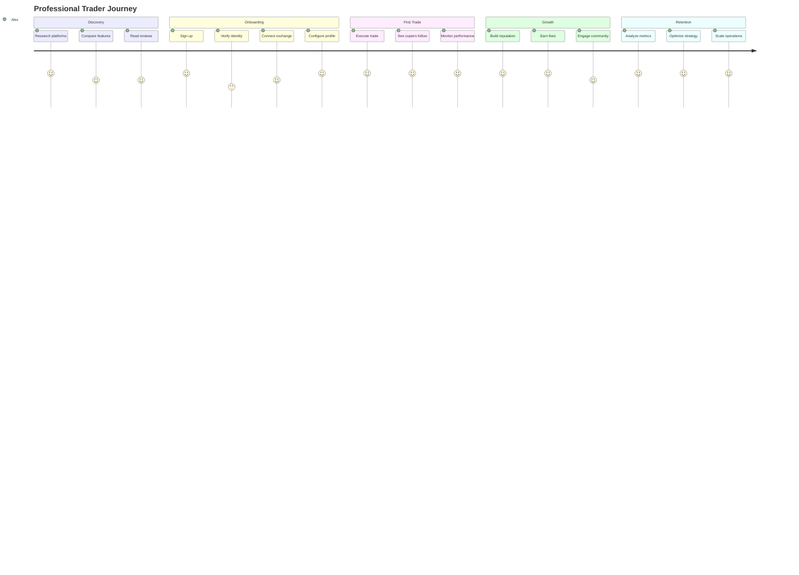
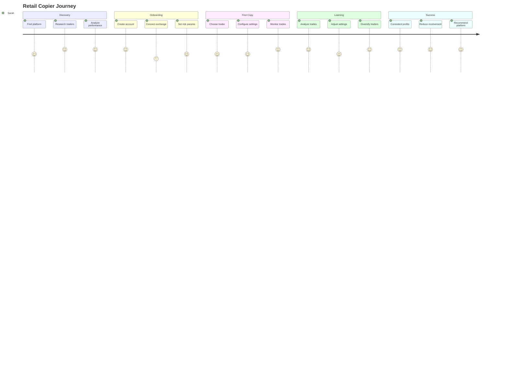

# User Journeys - CopyTrade V2 Platform

## Table of Contents
1. [Overview](#overview)
2. [User Personas](#user-personas)
3. [Journey Maps](#journey-maps)
4. [Detailed User Flows](#detailed-user-flows)
5. [Edge Cases & Error Scenarios](#edge-cases--error-scenarios)
6. [Cross-Platform Journey](#cross-platform-journey)
7. [Notification Touchpoints](#notification-touchpoints)

## Overview

This document outlines comprehensive user journeys for all user types on the CopyTrade V2 platform. Each journey is mapped from initial discovery through ongoing platform usage, including all touchpoints, decision points, and potential friction areas.

## User Personas

### 1. Professional Trader - "Alex"
- **Background**: 5+ years trading experience, manages $500K+ portfolio
- **Goals**: Monetize expertise, build following, maintain reputation
- **Pain Points**: Manual trade sharing, lack of performance tracking
- **Technical Level**: Advanced
- **Devices**: Desktop (primary), Mobile (monitoring)

### 2. Retail Copier - "Sarah"
- **Background**: 1-2 years trading experience, $10K portfolio
- **Goals**: Learn from experts, automate trading, reduce time commitment
- **Pain Points**: Emotional trading, inconsistent results, FOMO
- **Technical Level**: Intermediate
- **Devices**: Mobile (primary), Desktop (analysis)

### 3. Beginner Copier - "Mike"
- **Background**: New to crypto, $1K starting capital
- **Goals**: Safe entry to trading, passive income, education
- **Pain Points**: Overwhelmed by complexity, fear of losses
- **Technical Level**: Basic
- **Devices**: Mobile only

### 4. Platform Admin - "Emma"
- **Background**: Platform operations manager
- **Goals**: Maintain platform health, resolve disputes, ensure compliance
- **Pain Points**: User complaints, fraud detection, system monitoring
- **Technical Level**: Advanced
- **Devices**: Desktop only

## Journey Maps

### Trader Journey Map



### Copier Journey Map



## Detailed User Flows

### 1. New Trader Onboarding Flow

#### Step 1: Landing & Registration
```
User arrives at landing page
    ↓
Views "Become a Trader" CTA
    ↓
Clicks "Start Trading Journey"
    ↓
Registration form appears
    - Email address
    - Username (unique)
    - Password (strength indicator)
    - Referral code (optional)
    - Terms acceptance
    ↓
Email verification sent
    ↓
User verifies email
    ↓
Account created successfully
```

#### Step 2: Profile Setup
```
Welcome screen with progress indicator (0/5 complete)
    ↓
Step 1: Basic Information
    - Display name
    - Profile photo
    - Bio (character limit: 500)
    - Trading experience level
    - Primary trading style
    ↓
Step 2: Trading Strategy Description
    - Strategy name
    - Detailed description
    - Risk level (Conservative/Moderate/Aggressive)
    - Typical holding period
    - Preferred markets
    ↓
Step 3: Performance Settings
    - Minimum copy amount ($100 default)
    - Performance fee (0-30%)
    - Maximum copiers (optional)
    - Public/Private profile
    ↓
Step 4: Exchange Connection
    - Select exchange (Bitget/Bybit)
    - API key creation guide
    - Enter API credentials
    - Test connection
    - Set permissions (Futures trading required)
    ↓
Step 5: Verification
    - Identity verification (KYC)
    - Proof of trading experience
    - Review and submit
    ↓
Profile under review (24-48 hours)
    ↓
Approval notification
    ↓
Trader dashboard access granted
```

#### Step 3: First Trade Broadcast
```
Trader executes trade on exchange
    ↓
Platform detects via WebSocket
    ↓
Trade appears in activity feed
    ↓
Notification: "Your trade is being copied by X users"
    ↓
Real-time position tracking begins
    ↓
P&L updates in dashboard
```

### 2. New Copier Onboarding Flow

#### Step 1: Discovery & Registration
```
User searches "crypto copy trading"
    ↓
Arrives at platform via SEO/Ads
    ↓
Views hero section with benefits
    ↓
Explores trader leaderboard
    ↓
Clicks "Start Copying"
    ↓
Quick registration (Social login available)
    - Google OAuth
    - Email/Password
    ↓
Email verification
    ↓
Account created
```

#### Step 2: Guided Setup
```
Welcome tutorial begins
    ↓
Step 1: Risk Profile Quiz
    - Investment experience
    - Risk tolerance
    - Investment goals
    - Time commitment
    Result: Personalized recommendations
    ↓
Step 2: Connect Exchange
    - Educational content about API keys
    - Step-by-step guide with screenshots
    - Video tutorial option
    - Create read-only API first
    - Upgrade to trading API
    - Connection test
    ↓
Step 3: Fund Account Check
    - Verify minimum balance
    - Explanation of margin requirements
    - Funding instructions if needed
    ↓
Step 4: Risk Management Setup
    - VAR type selection with examples
    - Set maximum position size
    - Daily loss limits
    - Explanation of each setting
    ↓
Setup complete celebration screen
```

#### Step 3: Finding First Trader
```
Personalized trader recommendations
    ↓
Filter options:
    - Performance metrics
    - Risk level
    - Trading style
    - Minimum investment
    ↓
Trader profile exploration
    - Performance charts
    - Trade history
    - Risk metrics
    - Copier testimonials
    ↓
"Simulate" feature
    - See historical results if copied
    - Backtest with user's settings
    ↓
Decision to follow
    ↓
Copy settings configuration
    - Position sizing method
    - Maximum trades per day
    - Specific pairs to copy/ignore
    - Stop loss adjustment
    ↓
Confirmation screen with summary
    ↓
Begin copying notification
```

### 3. Active Trading Session Flow

#### For Traders:
```
Morning routine:
Check overnight positions → Review market conditions → 
Analyze opportunities → Prepare trade setups

Trade execution:
Open exchange platform → Place trade → 
Platform detects automatically → Copiers notified → 
Position tracked in dashboard

Position management:
Monitor P&L → Adjust stops/targets → 
Close position → Performance updated → 
Copiers' positions closed → Fees calculated

End of day:
Review daily performance → Analyze copier metrics → 
Respond to copier questions → Plan next day
```

#### For Copiers:
```
Notification received: "Alex opened BTCUSDT Long"
    ↓
Options:
1. Do nothing (auto-copy active)
2. View trade details
3. Adjust position size
4. Skip this trade
    ↓
If viewing details:
    - Entry price and size
    - Trader's reasoning (if shared)
    - Your position size
    - Risk metrics
    ↓
Position monitoring:
    - Real-time P&L
    - Price alerts
    - Compare to trader's position
    ↓
Position closed notification
    - Final P&L
    - Performance impact
    - Fees paid
```

### 4. Risk Management Configuration Flow

```
Navigate to Risk Settings
    ↓
Current settings overview with tooltips
    ↓
Modify VAR Settings:
    - Toggle between percentage/fixed
    - Slider for amount (visual feedback)
    - Example calculations shown
    ↓
Position Limits:
    - Max position size (USD)
    - Max open positions
    - Per-symbol limits
    ↓
Loss Protection:
    - Daily loss limit
    - Weekly loss limit
    - Action on limit (pause/notify)
    ↓
Advanced Settings:
    - Correlation limits
    - Excluded trading hours
    - Leverage restrictions
    ↓
Review changes with before/after
    ↓
Save with confirmation
    ↓
Settings applied to future trades
```

### 5. Performance Analytics Flow

#### Trader Analytics:
```
Dashboard Overview:
    - Total copiers
    - AUM (Assets Under Management)
    - Monthly revenue
    - Performance metrics

Detailed Analytics:
    ↓
Time period selector
    ↓
Metrics displayed:
    - Win rate
    - Average R:R
    - Sharpe ratio
    - Maximum drawdown
    - Best/worst trades
    ↓
Copier Analytics:
    - Copier retention
    - Geographic distribution
    - Average copy amount
    - Copier satisfaction
    ↓
Export options:
    - PDF report
    - CSV data
    - API access
```

#### Copier Analytics:
```
Portfolio Overview:
    - Total P&L
    - Active positions
    - Portfolio distribution

Per-Trader Analysis:
    - Individual trader performance
    - Contribution to portfolio
    - Risk metrics
    - Fee analysis

Comparison Tools:
    - Compare to market
    - Compare to other copiers
    - What-if scenarios
```

### 6. Dispute Resolution Flow

```
Issue encountered (e.g., unexpected trade)
    ↓
Navigate to Support Center
    ↓
Select issue category:
    - Trade execution
    - Billing/Fees
    - Technical issues
    - Trader concerns
    ↓
Automated resolution attempt:
    - FAQ suggestions
    - Video guides
    - Common solutions
    ↓
If unresolved:
    Create support ticket
        - Auto-filled context
        - Screenshot upload
        - Urgency level
    ↓
Ticket acknowledged (instant)
    ↓
Human review (within 4 hours)
    ↓
Resolution communication
    ↓
Satisfaction survey
```

### 7. Mobile-Specific Flows

#### Quick Actions (Mobile):
```
3D Touch / Long Press on app icon
    ↓
Quick actions menu:
    - View positions
    - Pause copying
    - Check P&L
    ↓
Biometric authentication
    ↓
Action completed
```

#### Push Notification Flow:
```
Notification received
    ↓
Notification preview:
    "🟢 Alex opened ETHUSDT Long"
    ↓
Tap notification
    ↓
Deep link to trade details
    ↓
Swipe actions:
    - Skip trade
    - View details
    - Mute trader
```

### 8. Subscription Management Flow

```
Current subscriptions overview
    ↓
For each trader:
    - Performance summary
    - Active since date
    - Total P&L
    - Quick actions
    ↓
Modify subscription:
    - Pause temporarily
    - Adjust settings
    - Unfollow
    ↓
If unfollowing:
    - Reason selection
    - Open positions handling
    - Confirmation
    ↓
Feedback to trader (anonymous)
```

## Edge Cases & Error Scenarios

### 1. Insufficient Balance
```
Copy trade triggered → Balance check fails →
Notification: "Insufficient balance" →
Options: Fund account / Reduce position size / Skip trade →
If funding: Direct link to exchange →
If reducing: Auto-calculate maximum possible →
If skipping: Log for analytics
```

### 2. API Connection Lost
```
WebSocket disconnect detected →
Attempt reconnection (3 retries) →
If failed: Email notification →
Grace period (5 minutes) →
If restored: Sync missed trades →
If not: Pause copying + urgent notification
```

### 3. Exchange Downtime
```
Exchange API returns errors →
Circuit breaker activated →
All users notified →
Trades queued (if possible) →
Status page updated →
When restored: Process queue carefully
```

### 4. Trader Goes Rogue
```
Unusual activity detected:
- Excessive trades
- Huge position sizes
- Different trading pattern
    ↓
Automatic safeguards:
- Rate limiting
- Position size caps
- Copier notifications
    ↓
Manual review triggered
    ↓
Possible outcomes:
- Temporary suspension
- Copier protection mode
- Forced position closing
```

### 5. Dispute Between Trader and Copier
```
Copier reports issue →
Support ticket created →
Both parties notified →
Trade logs pulled automatically →
Mediator assigned →
Resolution process:
    - Fact finding
    - Policy review
    - Decision made
    - Appeals process
    ↓
Outcome enforced
```

## Cross-Platform Journey

### Starting on Mobile, Continuing on Desktop
```
Mobile: Discover platform via app store →
Mobile: Create account and basic setup →
Mobile: Browse traders and follow one →
Desktop: Receive email about web platform →
Desktop: Login with same credentials →
Desktop: Access advanced analytics →
Desktop: Configure complex strategies →
Mobile: Receive trade notifications →
Mobile: Quick position checks →
Desktop: End-of-day analysis
```

### Multi-Account Management
```
Power user with multiple accounts →
Account switcher in UI →
Consolidated view option →
Separate or combined analytics →
Bulk actions across accounts →
Different strategies per account
```

## Notification Touchpoints

### Critical Notifications (Always Sent)
1. **Trade Execution**
   - Channel: Push, Email, Telegram
   - Content: Trader, symbol, direction, your size
   - Action: View, Skip, Modify

2. **Large Losses**
   - Channel: All available
   - Content: Loss amount, percentage, action needed
   - Action: Close positions, Pause copying

3. **System Issues**
   - Channel: All available
   - Content: Issue description, impact, ETA
   - Action: View status, Contact support

### Informational Notifications (User Preference)
1. **Daily Summary**
   - Channel: Email
   - Time: User-selected
   - Content: P&L, active positions, top performers

2. **Weekly Report**
   - Channel: Email
   - Content: Detailed analytics, suggestions

3. **Trader Updates**
   - Channel: In-app, Email
   - Content: Strategy changes, market commentary

4. **Platform Updates**
   - Channel: In-app banner
   - Content: New features, maintenance

### Smart Notification Rules
```
If user active in-app: Suppress push
If large loss: Override DND settings
If positive milestone: Celebration animation
If inactive 7 days: Re-engagement campaign
If high-value user: Priority support channel
```

## User Journey Optimization Points

### Reducing Friction
1. **Onboarding**
   - Pre-fill from social profiles
   - Progressive disclosure
   - Skip-now-complete-later options
   - Interactive tutorials

2. **Daily Use**
   - Smart defaults
   - One-click actions
   - Keyboard shortcuts
   - Saved preferences

3. **Complex Tasks**
   - Wizards for setup
   - Templates for common configs
   - Undo functionality
   - Preview before commit

### Increasing Engagement
1. **Gamification**
   - Achievement badges
   - Leaderboards
   - Milestone rewards
   - Referral bonuses

2. **Education**
   - Trading academy
   - Webinars with top traders
   - Risk management courses
   - Market analysis

3. **Community**
   - Trader AMAs
   - Discussion forums
   - Copy trader groups
   - Success stories

### Retention Strategies
1. **Performance**
   - Success notifications
   - Improvement suggestions
   - Benchmark comparisons
   - Goal tracking

2. **Relationship Building**
   - Trader-copier messaging
   - Exclusive strategies
   - VIP programs
   - Personal success manager

3. **Continuous Value**
   - New trader recommendations
   - Strategy optimization
   - Market insights
   - Feature early access

---

This comprehensive user journey documentation serves as the foundation for creating an intuitive, engaging, and successful copy trading platform that meets the needs of all user types while driving business objectives.