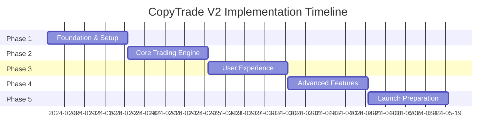

# Implementation Plan - CopyTrade V2

## Table of Contents
1. [Executive Summary](#executive-summary)
2. [Implementation Phases](#implementation-phases)
3. [Phase 1: Foundation (Weeks 1-4)](#phase-1-foundation-weeks-1-4)
4. [Phase 2: Core Trading Engine (Weeks 5-8)](#phase-2-core-trading-engine-weeks-5-8)
5. [Phase 3: User Experience (Weeks 9-12)](#phase-3-user-experience-weeks-9-12)
6. [Phase 4: Advanced Features (Weeks 13-16)](#phase-4-advanced-features-weeks-13-16)
7. [Phase 5: Launch Preparation (Weeks 17-20)](#phase-5-launch-preparation-weeks-17-20)
8. [Team Structure & Responsibilities](#team-structure--responsibilities)
9. [Risk Management](#risk-management)
10. [Success Metrics](#success-metrics)

## Executive Summary

This implementation plan outlines a 20-week development schedule for CopyTrade V2, divided into 5 distinct phases. Each phase has clear deliverables, acceptance criteria, and a Definition of Done (DoD) to ensure quality and progress tracking.

### Key Milestones
- **Week 4**: Infrastructure and authentication complete
- **Week 8**: Core trading functionality operational
- **Week 12**: Full user interface implemented
- **Week 16**: Advanced features integrated
- **Week 20**: Production-ready platform launched

### Budget Estimate
- Development Team: $400,000
- Infrastructure: $50,000
- Third-party Services: $30,000
- Marketing & Launch: $70,000
- **Total**: $550,000

## Implementation Phases

### Phase Overview



## Phase 1: Foundation (Weeks 1-4)

### Objectives
Establish the technical foundation, development environment, and core infrastructure for the platform.

### Week 1-2: Project Setup & Infrastructure

#### Tasks
1. **Development Environment**
   - [ ] Set up monorepo structure
   - [ ] Configure development tools (ESLint, Prettier, Husky)
   - [ ] Set up CI/CD pipelines
   - [ ] Configure Docker environments
   - [ ] Create development documentation

2. **Infrastructure Setup**
   - [ ] Provision Supabase project
   - [ ] Set up Redis instance
   - [ ] Configure Vercel project
   - [ ] Set up Render.com services
   - [ ] Configure monitoring (Sentry)

3. **Database Design**
   - [ ] Implement database schema
   - [ ] Set up migrations system
   - [ ] Create seed data scripts
   - [ ] Configure backup procedures
   - [ ] Test database connections

#### Deliverables
- Fully configured development environment
- Database schema implemented
- CI/CD pipelines operational
- Development guidelines documented

#### Definition of Done
- [ ] All developers can run project locally
- [ ] Database migrations run successfully
- [ ] CI/CD pipeline passes all checks
- [ ] Infrastructure monitoring active
- [ ] Security scan shows no vulnerabilities

### Week 3-4: Authentication & User Management

#### Tasks
1. **Authentication System**
   - [ ] Implement JWT authentication
   - [ ] Create refresh token mechanism
   - [ ] Set up password reset flow
   - [ ] Implement email verification
   - [ ] Add OAuth providers (Google)

2. **User Management**
   - [ ] Create user registration API
   - [ ] Implement user profile endpoints
   - [ ] Build role management system
   - [ ] Create user settings API
   - [ ] Implement KYC workflow

3. **Frontend Auth Flow**
   - [ ] Create login/register pages
   - [ ] Implement auth context/store
   - [ ] Build protected routes
   - [ ] Create user menu component
   - [ ] Add loading states

#### Deliverables
- Complete authentication system
- User management APIs
- Frontend authentication flow
- KYC integration ready

#### Definition of Done
- [ ] Users can register and login
- [ ] JWT tokens properly managed
- [ ] Password reset works end-to-end
- [ ] Role-based access control working
- [ ] All auth endpoints have >90% test coverage

## Phase 2: Core Trading Engine (Weeks 5-8)

### Objectives
Build the core trading functionality including exchange connections, trade detection, and copy trading logic.

### Week 5-6: Exchange Integration

#### Tasks
1. **Exchange Connectors**
   - [ ] Implement Bitget connector
   - [ ] Implement Bybit V5 connector
   - [ ] Create unified exchange interface
   - [ ] Add WebSocket connections
   - [ ] Implement rate limiting

2. **API Key Management**
   - [ ] Create secure key storage
   - [ ] Implement key encryption/decryption
   - [ ] Build API key validation
   - [ ] Add permission checking
   - [ ] Create key rotation system

3. **Connection Testing**
   - [ ] Build connection test endpoints
   - [ ] Create mock trading mode
   - [ ] Implement error handling
   - [ ] Add connection monitoring
   - [ ] Create reconnection logic

#### Deliverables
- Working exchange connectors
- Secure API key management
- Connection testing tools
- WebSocket managers

#### Definition of Done
- [ ] Can connect to both exchanges
- [ ] API keys encrypted at rest
- [ ] WebSocket connections stable
- [ ] Rate limiting prevents bans
- [ ] 95% uptime in testing

### Week 7-8: Trade Detection & Replication

#### Tasks
1. **Trade Detection System**
   - [ ] Build trade listener service
   - [ ] Create trade parser
   - [ ] Implement trade validation
   - [ ] Add duplicate detection
   - [ ] Create trade queue system

2. **Copy Trading Logic**
   - [ ] Build position size calculator
   - [ ] Implement risk validation
   - [ ] Create order placement system
   - [ ] Add slippage protection
   - [ ] Build execution monitoring

3. **Position Management**
   - [ ] Create position tracking
   - [ ] Implement P&L calculation
   - [ ] Build position sync system
   - [ ] Add position closing logic
   - [ ] Create position history

#### Deliverables
- Trade detection system
- Copy trading engine
- Position management system
- Real-time monitoring

#### Definition of Done
- [ ] Trades detected < 1 second
- [ ] Copy execution < 2 seconds
- [ ] Position tracking accurate
- [ ] Risk rules enforced
- [ ] All critical paths tested

## Phase 3: User Experience (Weeks 9-12)

### Objectives
Build the complete user interface for traders and copiers with focus on usability and performance.

### Week 9-10: Core UI Components

#### Tasks
1. **Design System Implementation**
   - [ ] Set up Tailwind + shadcn/ui
   - [ ] Create base components
   - [ ] Implement theme system
   - [ ] Build responsive layouts
   - [ ] Add animation library

2. **Dashboard Development**
   - [ ] Create dashboard layout
   - [ ] Build stat cards
   - [ ] Implement charts (TradingView)
   - [ ] Add real-time updates
   - [ ] Create mobile view

3. **Trader Discovery**
   - [ ] Build trader list page
   - [ ] Create filtering system
   - [ ] Implement search
   - [ ] Add trader cards
   - [ ] Build comparison tool

#### Deliverables
- Complete design system
- Functional dashboard
- Trader discovery interface
- Mobile-responsive layouts

#### Definition of Done
- [ ] All components match design specs
- [ ] Dashboard loads < 2 seconds
- [ ] Mobile experience smooth
- [ ] Accessibility audit passed
- [ ] Cross-browser testing complete

### Week 11-12: Trading Interface

#### Tasks
1. **Trader Profile Pages**
   - [ ] Create profile layout
   - [ ] Build performance charts
   - [ ] Add trade history view
   - [ ] Implement follow system
   - [ ] Create sharing features

2. **Copy Configuration**
   - [ ] Build settings interface
   - [ ] Create risk controls
   - [ ] Add position sizing options
   - [ ] Implement preview system
   - [ ] Build confirmation flow

3. **Portfolio Management**
   - [ ] Create portfolio overview
   - [ ] Build position cards
   - [ ] Add P&L tracking
   - [ ] Implement quick actions
   - [ ] Create export features

#### Deliverables
- Complete trader profiles
- Copy configuration system
- Portfolio management interface
- Real-time position tracking

#### Definition of Done
- [ ] Profile pages fully functional
- [ ] Copy settings save correctly
- [ ] Portfolio updates real-time
- [ ] All forms validated
- [ ] User flows tested

## Phase 4: Advanced Features (Weeks 13-16)

### Objectives
Implement advanced features including analytics, notifications, and admin tools.

### Week 13-14: Analytics & Reporting

#### Tasks
1. **Performance Analytics**
   - [ ] Build analytics engine
   - [ ] Create metric calculations
   - [ ] Implement chart library
   - [ ] Add comparison tools
   - [ ] Build export system

2. **Reporting System**
   - [ ] Create report templates
   - [ ] Build PDF generation
   - [ ] Add scheduling system
   - [ ] Implement tax reports
   - [ ] Create API endpoints

3. **AI Integration**
   - [ ] Integrate Gemini API
   - [ ] Build recommendation engine
   - [ ] Create risk analysis
   - [ ] Add market insights
   - [ ] Implement chatbot

#### Deliverables
- Analytics dashboard
- Reporting system
- AI-powered features
- Export functionality

#### Definition of Done
- [ ] Analytics calculate correctly
- [ ] Reports generate < 5 seconds
- [ ] AI recommendations relevant
- [ ] Export formats working
- [ ] Performance optimized

### Week 15-16: Communication & Admin

#### Tasks
1. **Notification System**
   - [ ] Build notification service
   - [ ] Integrate Telegram bot
   - [ ] Add email notifications
   - [ ] Create in-app alerts
   - [ ] Implement preferences

2. **Admin Dashboard**
   - [ ] Create admin interface
   - [ ] Build user management
   - [ ] Add system monitoring
   - [ ] Implement moderation tools
   - [ ] Create analytics views

3. **Support System**
   - [ ] Build help center
   - [ ] Create ticket system
   - [ ] Add live chat
   - [ ] Implement FAQ
   - [ ] Create documentation

#### Deliverables
- Multi-channel notifications
- Admin dashboard
- Support system
- Help documentation

#### Definition of Done
- [ ] Notifications deliver reliably
- [ ] Admin can manage all users
- [ ] Support tickets routed
- [ ] Documentation complete
- [ ] Security audit passed

## Phase 5: Launch Preparation (Weeks 17-20)

### Objectives
Prepare the platform for production launch with testing, optimization, and marketing preparation.

### Week 17-18: Testing & Optimization

#### Tasks
1. **Quality Assurance**
   - [ ] Conduct full E2E testing
   - [ ] Perform load testing
   - [ ] Execute security audit
   - [ ] Run penetration testing
   - [ ] Complete UAT

2. **Performance Optimization**
   - [ ] Optimize database queries
   - [ ] Implement caching strategy
   - [ ] Reduce bundle sizes
   - [ ] Optimize images
   - [ ] Add CDN support

3. **Bug Fixing**
   - [ ] Fix critical bugs
   - [ ] Address performance issues
   - [ ] Resolve UI inconsistencies
   - [ ] Fix edge cases
   - [ ] Polish animations

#### Deliverables
- Test reports
- Performance benchmarks
- Security certification
- Bug-free platform

#### Definition of Done
- [ ] Zero critical bugs
- [ ] Load test passed (10K users)
- [ ] Security vulnerabilities fixed
- [ ] Performance targets met
- [ ] UAT sign-off received

### Week 19-20: Launch & Monitoring

#### Tasks
1. **Production Deployment**
   - [ ] Set up production environment
   - [ ] Configure auto-scaling
   - [ ] Deploy monitoring
   - [ ] Set up alerting
   - [ ] Create runbooks

2. **Launch Activities**
   - [ ] Beta user onboarding
   - [ ] Marketing campaign launch
   - [ ] Press release
   - [ ] Community building
   - [ ] Partner outreach

3. **Post-Launch Support**
   - [ ] 24/7 monitoring setup
   - [ ] Support team training
   - [ ] Incident response plan
   - [ ] Feedback collection
   - [ ] Iteration planning

#### Deliverables
- Production platform
- Marketing materials
- Support documentation
- Monitoring dashboards

#### Definition of Done
- [ ] Platform live and stable
- [ ] 100+ beta users active
- [ ] Support team trained
- [ ] Monitoring operational
- [ ] Feedback loop established

## Team Structure & Responsibilities

### Core Team

#### Development Team (8 people)
1. **Tech Lead** (1)
   - Architecture decisions
   - Code review
   - Technical mentorship
   - Integration oversight

2. **Backend Engineers** (3)
   - API development
   - Exchange integration
   - Trading engine
   - Database optimization

3. **Frontend Engineers** (3)
   - UI implementation
   - State management
   - Performance optimization
   - Mobile responsiveness

4. **DevOps Engineer** (1)
   - Infrastructure management
   - CI/CD pipelines
   - Monitoring setup
   - Security implementation

#### Product Team (3 people)
1. **Product Manager** (1)
   - Requirements gathering
   - Stakeholder communication
   - Feature prioritization
   - User research

2. **UI/UX Designer** (1)
   - Design system
   - User flows
   - Prototypes
   - Usability testing

3. **QA Engineer** (1)
   - Test planning
   - Manual testing
   - Automation setup
   - Bug tracking

#### Operations Team (3 people)
1. **Marketing Manager** (1)
   - Launch strategy
   - Content creation
   - Community management
   - Partnership development

2. **Customer Success** (1)
   - User onboarding
   - Support documentation
   - Feedback collection
   - User training

3. **Compliance Officer** (1)
   - Regulatory compliance
   - KYC/AML procedures
   - Terms of service
   - Privacy policy

### Communication Structure

#### Daily Activities
- **Standup**: 9:00 AM (15 min)
- **Code Review**: Continuous
- **PR Reviews**: Within 4 hours
- **Slack Updates**: Real-time

#### Weekly Activities
- **Sprint Planning**: Monday 2:00 PM
- **Demo Session**: Friday 3:00 PM
- **Retrospective**: Friday 4:00 PM
- **Stakeholder Update**: Friday 5:00 PM

#### Tools
- **Project Management**: Jira/Linear
- **Communication**: Slack
- **Documentation**: Notion
- **Code Repository**: GitHub
- **Design**: Figma

## Risk Management

### Technical Risks

#### Risk: Exchange API Changes
- **Probability**: Medium
- **Impact**: High
- **Mitigation**: 
  - Version checking system
  - Adapter pattern for easy updates
  - Regular API monitoring
  - Fallback mechanisms

#### Risk: Scalability Issues
- **Probability**: Medium
- **Impact**: High
- **Mitigation**:
  - Load testing from Phase 1
  - Horizontal scaling design
  - Performance monitoring
  - Capacity planning

#### Risk: Security Breach
- **Probability**: Low
- **Impact**: Critical
- **Mitigation**:
  - Regular security audits
  - Encryption at rest/transit
  - Rate limiting
  - Incident response plan

### Business Risks

#### Risk: Regulatory Changes
- **Probability**: Medium
- **Impact**: High
- **Mitigation**:
  - Legal consultation
  - Flexible architecture
  - Multi-jurisdiction planning
  - Compliance monitoring

#### Risk: Competition
- **Probability**: High
- **Impact**: Medium
- **Mitigation**:
  - Unique features
  - Superior UX
  - Community building
  - Fast iteration

#### Risk: User Adoption
- **Probability**: Medium
- **Impact**: High
- **Mitigation**:
  - Beta program
  - Referral system
  - Educational content
  - Influencer partnerships

### Contingency Plans

1. **Delayed Timeline**
   - Prioritize MVP features
   - Increase team size
   - Reduce scope
   - Phased launch

2. **Budget Overrun**
   - Secure additional funding
   - Reduce marketing spend
   - Delay advanced features
   - Optimize infrastructure costs

3. **Technical Blockers**
   - Expert consultants
   - Alternative solutions
   - Simplified approach
   - Partner integrations

## Success Metrics

### Development Metrics

#### Code Quality
- **Test Coverage**: >80%
- **Code Review**: 100% reviewed
- **Technical Debt**: <10%
- **Bug Density**: <1 per KLOC

#### Performance
- **API Response**: <200ms p95
- **Page Load**: <2s
- **Uptime**: >99.9%
- **Error Rate**: <0.1%

### Business Metrics

#### Week 1 Post-Launch
- **Registrations**: 1,000+
- **Active Users**: 500+
- **Traders Onboarded**: 50+
- **Trade Volume**: $100K+

#### Month 1 Post-Launch
- **Registrations**: 5,000+
- **Active Users**: 2,000+
- **Traders Onboarded**: 200+
- **Trade Volume**: $1M+

#### Month 3 Post-Launch
- **Registrations**: 15,000+
- **Active Users**: 7,500+
- **Traders Onboarded**: 500+
- **Trade Volume**: $10M+

### User Satisfaction

#### Metrics
- **NPS Score**: >50
- **App Rating**: >4.5
- **Support Tickets**: <5% of users
- **Churn Rate**: <10% monthly

#### Feedback Loops
- Weekly user interviews
- In-app feedback widget
- Community forum
- Regular surveys

## Detailed Sprint Plans

### Sprint Planning Template

```markdown
## Sprint X (Week Y-Z)

### Sprint Goal
[Clear, achievable goal for the sprint]

### User Stories
1. **[Story Title]**
   - Points: X
   - Assignee: [Name]
   - Acceptance Criteria:
     - [ ] Criteria 1
     - [ ] Criteria 2

### Technical Tasks
1. **[Task Title]**
   - Hours: X
   - Assignee: [Name]
   - Dependencies: [List]

### Definition of Done
- [ ] Code reviewed
- [ ] Tests written
- [ ] Documentation updated
- [ ] Deployed to staging
- [ ] QA approved
```

### Release Checklist

#### Pre-Release
- [ ] Feature freeze announced
- [ ] Release branch created
- [ ] Full regression testing
- [ ] Performance testing
- [ ] Security scan
- [ ] Documentation review

#### Release Day
- [ ] Backup production database
- [ ] Deploy to production
- [ ] Smoke tests passed
- [ ] Monitoring alerts configured
- [ ] Team on standby
- [ ] Communication sent

#### Post-Release
- [ ] Monitor error rates
- [ ] Check performance metrics
- [ ] Gather user feedback
- [ ] Document lessons learned
- [ ] Plan hotfixes if needed
- [ ] Celebrate success!

## Conclusion

This implementation plan provides a clear roadmap for building CopyTrade V2 over 20 weeks. Success depends on:

1. **Clear Communication**: Daily standups and weekly demos
2. **Quality Focus**: Comprehensive DoD for each phase
3. **Risk Management**: Proactive mitigation strategies
4. **User Focus**: Regular feedback and iteration
5. **Team Collaboration**: Cross-functional cooperation

By following this plan and maintaining flexibility for inevitable changes, we can deliver a world-class copy trading platform that serves both professional traders and retail investors effectively.

---

**Next Steps**:
1. Team assembly and onboarding
2. Development environment setup
3. Stakeholder alignment meeting
4. Sprint 0 planning session
5. Kick-off celebration! 🚀